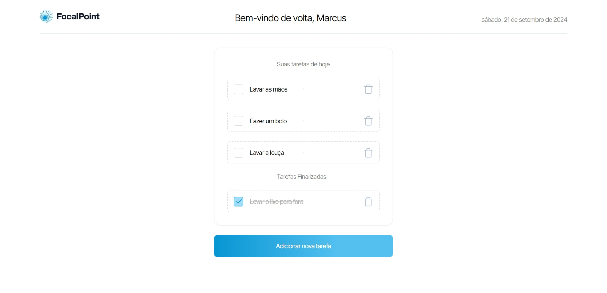

# Task Management Application



**Task Management Application** é um sistema de gerenciamento de tarefas que permite realizar operações CRUD (Criar, Ler, Atualizar, Deletar) em tarefas.

## Stack Tecnológica

- **ORM**: Prisma
- **Frontend**: React com Next.js
- **Backend**: Node.js com TypeScript
- **Banco de Dados**: Neste caso, estamos utilizando o SQLite, mas a migração para outro banco de dados pode ser realizada facilmente.

## Configuração do Projeto

### Pré-requisitos

- Node.js (versão 20 ou superior)

### Instalação

#### Configuração Manual

1. Clone o repositório:

   ```bash
   git clone https://github.com/valdir-alves3000/task-management-application-nextjs.git
   cd task-management-application-nextjs
   ```

2. Instale as dependências:

   ```bash
   npm install
   ```

3. Configure o banco de dados:

   Crie um arquivo `.env` na raiz do projeto e adicione a URL do seu banco de dados:

   ```env
   DATABASE_URL="file:./dev.db"
   ```

4. Execute as migrações do banco de dados:

   ```bash
   npx prisma migrate dev
   ```

5. Inicie o servidor:

   ```bash
   npm run dev
   ```

## Testes

Os testes são escritos em TypeScript e podem ser executados utilizando os seguintes comandos:

- Para rodar os testes unitários:
  ```bash
  npm run test:unit
  ```

- Para rodar os testes de ponta a ponta (e2e):
  ```bash
  npm run test:e2e
  ```

- Para rodar os testes em modo de observação:
  ```bash
  npm run test:watch
  ```

## Autor

<a href="https://github.com/valdir-alves3000/">
 
 <br />
 <sub style="margin-right: 1rem;"><b>Valdir Alves </b></sub>🚀</a>

<p style="margin-top: 0.5rem;">Feito com ❤️ por Valdir Alves. Entre em contato!</p>

[](http://linkedin.com/in/valdiralves3000)
[](mailto:valdiralves3000@gmail.com)
